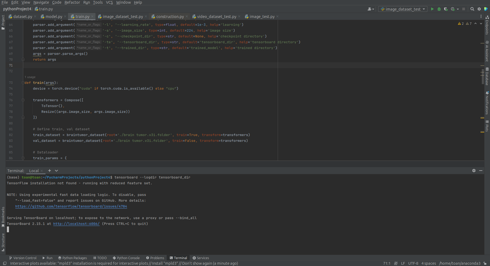
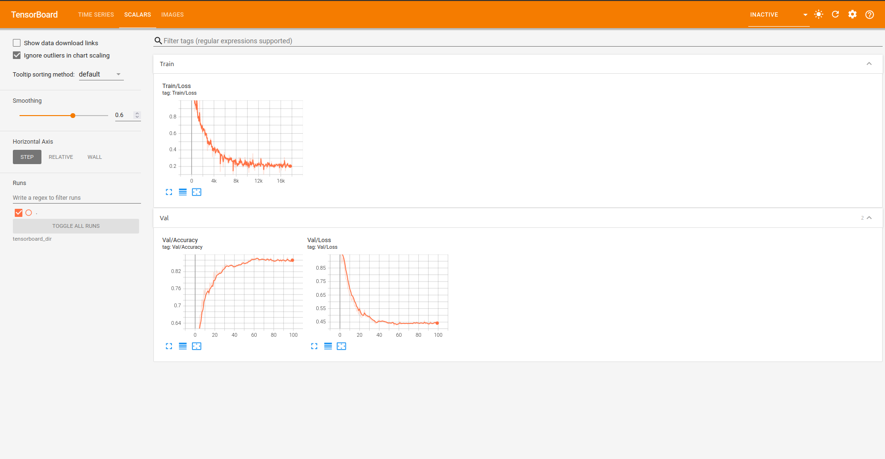
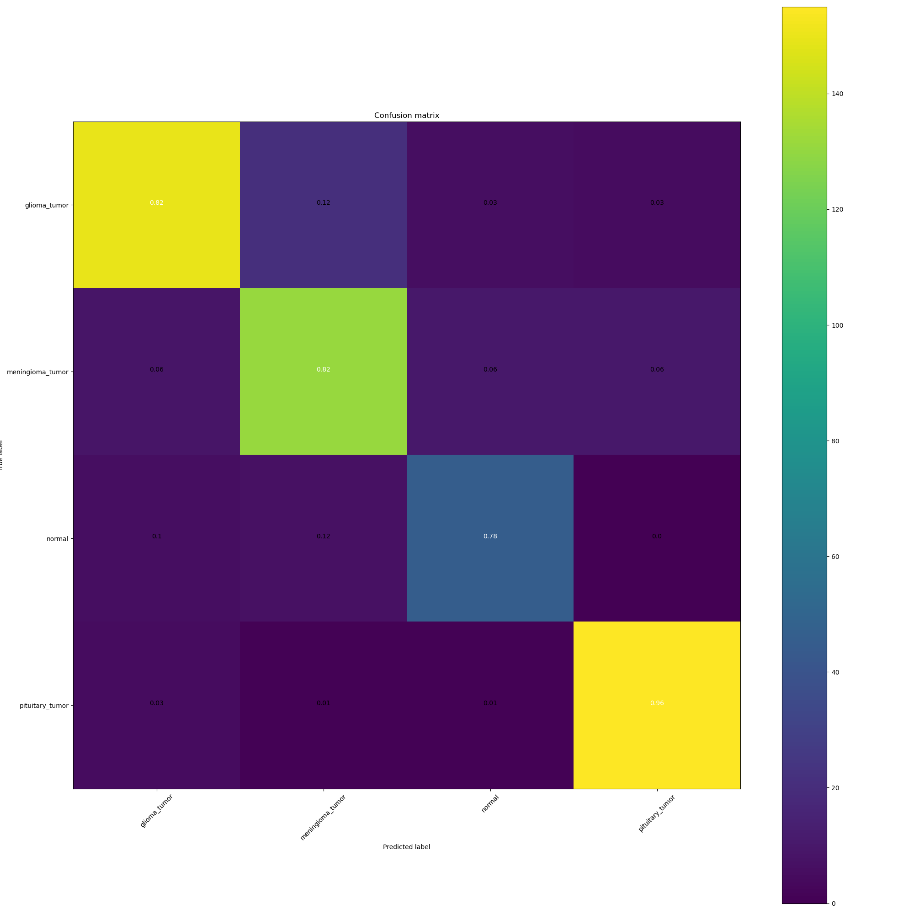

# Brain Tumor Image Classification using CNN (Self-built)

## Overview:
This project focuses on the classification of brain tumor images using Convolutional Neural Networks (CNNs). The aim is to develop a robust model capable of accurately identifying whether an input MRI image contains a tumor or not.

  

<em>Result</em>
 

## Dataset:
The dataset used in this project consists of MRI images of the brain, with corresponding labels indicating the presence or absence of tumors. It is important to note that obtaining such datasets may involve compliance with ethical and legal regulations.

You can download the dataset from [here](https://universe.roboflow.com/biomedical-engineering-mansoura-university/brain-tumor-dsxqq).

## Model Architecture:
The CNN architecture employed in this project is designed to effectively learn features from the input MRI images. It typically consists of convolutional layers for feature extraction, followed by pooling layers for dimensionality reduction, and fully connected layers for classification.

## Implementation Details:
1. **Data Preprocessing**: Before feeding the images into the network, preprocessing steps such as normalization, resizing,... might be applied to enhance the model's performance.
2. **Model Training**: The CNN model is trained using the labeled dataset. During training, the model learns to classify images into tumor and non-tumor classes by adjusting its parameters to minimize a defined loss function.
3. **Model Evaluation**: The trained model's performance is evaluated using metrics such as accuracy, precision, recall, and F1-score on a separate test set.
4. **Model Optimization**: Techniques like hyperparameter tuning, regularization, and optimization algorithms may be employed to improve the model's performance and generalization ability.
5. **Deployment**: Once the model achieves satisfactory performance, it can be deployed in real-world applications to classify brain tumor images automatically.

## Dependencies:
- Python 3.11
- Pytorch 2.1.2
- Tensorboard
- Numpy
- Matplotlib (for visualization)
- OpenCV (for image processing)

## Usage:
1. Clone the repository.
2. Install the necessary dependencies.
3. Prepare the dataset and organize it according to the project structure.
4. Train the model using the provided scripts or notebooks.
5. Evaluate the model's performance and fine-tune as necessary.
6. Deploy the model for inference on new brain tumor images.

7. Demo

## Contributing

Contributions are welcome! If you have ideas for improvements or new features, feel free to open an issue or submit a pull request.

## License

This project is licensed under the MIT License - see the [LICENSE](https://choosealicense.com/licenses/mit/) file for details.
